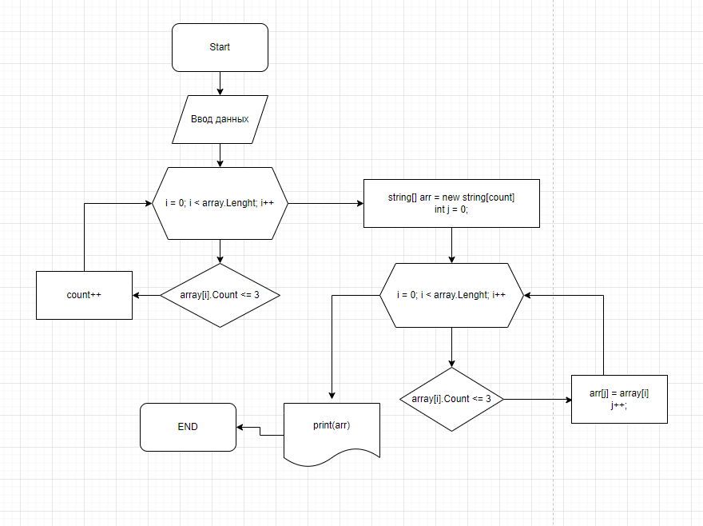

# Итоговая контрольная работа по основному блоку.

## Stage 1

### На 1 этапе, я создал репозиторий на сайте **GitHub**, и сделал клонирование на локальный, для работы с ним.

## Stage 2

### Я нарисовал блок-схему на сайте **draw.io** для решения поставленной задачи. 

## Stage 3

### На 3 этапе работы, я начал оформление файла README.md, чтобы снабдить работу текстовым описанием того, что я проделал на каждом этапе работы.